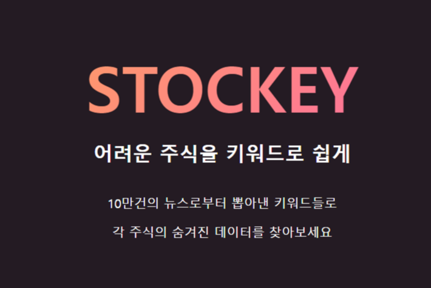
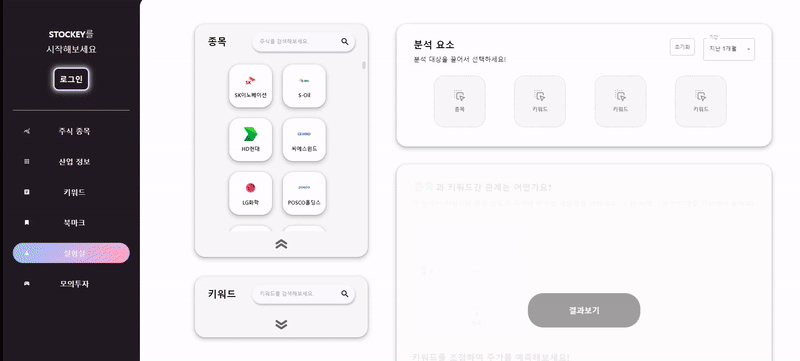

# STOCKEY

## 📖 상세 내용

---

 

- 뉴스 키워드와 주가, 산업 사이 상관관계 분석 제공

- 사용자가 선택한 주식 종목과 키워드의 회귀분석을 통한 예상 주가 정보 제공

- 모의투자를 통한 주식 시장 이해 및 사용자 유입

 

## 🛠️ 사용 기술 및 라이브러리

---

- html / css / TypeScript
- React / React-Query, Recoil / Styled-component
- React DnD / Highcharts

 

## 💡 성과

---

- React query, Recoil 활용한 전역 변수 및 비동기 데이터 체계적 관리
- Styled Component 활용한 가변 스타일링 적용
- React dnd, Highcharts, cheerio 등 라이브러리 적용
- 애자일 방법론 적용

 

## 🖥️ 담당한 기능 (Front-end)

---

### 실험실 페이지

- `React-Query` 활용한 무한스크롤
    - 애자일한 개발을 도모하기 위해, 무한스크롤 데이터인 경우 아닌 경우 모두 적용할 수 있도록 아코디언 component 제작
    - useInfiniteQuery hook 및 React-Infinite-Scroller library 활용
    - Infinite Query data 받은 후, data.pages를 flatMap 활용해 1차원 리스트로 변경 후 랜더링

- `React DnD` 활용한 드래그앤드랍
    - dragged된 주식 및 키워드 카드 상태 Recoil에서 관리
    - card를 drag 하는 경우, Recoil 데이터 확인 후 drop 가능 여부에 따라 drop Box css 변경
        - drop 불가할 경우 dark 처리와 red border 적용, drop 하더라도 데이터 변경 안되도록
    - MUI 활용해 drop 하는 경우와 삭제하는 경우 애니메이션 적용
        - 삭제시, 애니메이션 적용 후 Reocil 데이터 업데이트 하기 위해 setTimeout 적용

- 아코디언 open / close 상태에 따른 변화
    - Recoil의 selector 활용하여 아코디언의 open 상태에 따라 result panel의 상태 변경 (result panel 크기 및 위치 변화)
    - result panel 상태에 따라 하위 컴포넌트 랜더링 변경
    - MUI 및 css transition 활용한 애니메이션 추가

- `Highcharts` 활용한 그래프 데이터 랜더링
    - 그래프 점 데이터 및 직선 랜더링
    - guide 기반 style custom

- 사용자가 선택한 주식 종목과 키워드의 회귀분석을 통한 예상 주가 정보 제공 (완료 X)
    - BACK에서 받은 graph 데이터 중 마지막 데이터를 Recoil의 slider default 값으로 업데이트
    - 사용자가 slider 조정할때마다, Recoil 값 업데이트
    - BACK에서 받은 회귀 계수(query 데이터)와 사용자가 입력한 slider 값(recoil 데이터)을 연산하여 예상 주가 정보 랜더링

### 기타 컴포넌트

- `cheerio` 라이브러리 활용한 뉴스 섬네일 컴포넌트
    - Back에서 받은 news url기반으로, axios 요청 보냄
    - 네이버 뉴스 내에서 첫번째 이미지, 본문 아이디 기반으로 cheerio 활용해 크롤링
    - 크롤링한 데이터 활용해 섬네일 컴포넌트 제작